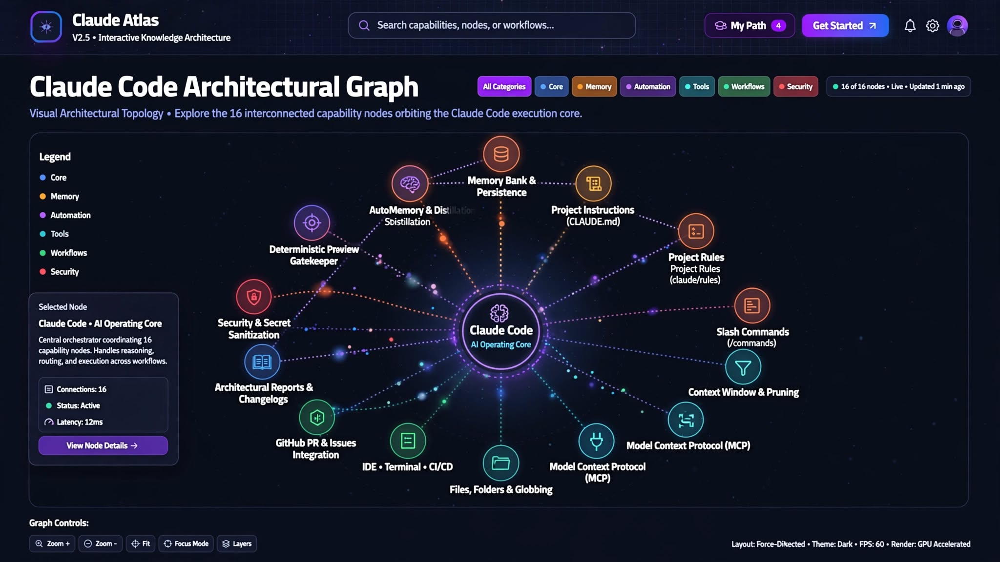

# 🗺️ Claude Atlas | أطلس كلود

<div align="center">



[](https://drive.google.com/file/d/1z7b0vtKROKoEnJsut6cPQiWbd6elZavN/view?usp=drivesdk)
[](package.json)
[](https://react.dev/)
[](https://www.typescriptlang.org/)
[](https://tailwindcss.com/)

**الموسوعة المعمارية التفاعلية والخريطة البصرية الشاملة لمنظومة Claude Code للمطورين والمهندسين**  
*The comprehensive interactive architectural encyclopedia and visual knowledge graph for the Claude Code ecosystem.*

[استكشف الخريطة المعمارية](#-أقسام-المنصة--platform-sections) • [المسارات التعليمية](#-المسارات-التعليمية--learning-paths) • [التشغيل المحلي](#-التثبيت-والتشغيل-المحلي--getting-started)

</div>

---

## 📖 نبذة عن المشروع | Overview

**أطلس كلود (Claude Atlas)** هو منصة معرفية تفاعلية مصممة خصيصاً للمطورين، مهندسي الأوامر (Prompt Engineers)، والفرق التقنية لفهم البنية الداخلية وهندسة منظومة **Claude Code** بعمق وبطريقة بصرية تطبيقية. 

على عكس أدوات المحادثة التقليدية، يقدم الأطلس خريطة متكاملة تربط بين:
- قواعد وملفات الدستور **`CLAUDE.md`**
- أنظمة الذاكرة التراكمية وسياق المشاريع **Memory Systems**
- مهارات وأدوات **`SKILL.md`**
- الوكلاء الفرعيين المستقلين **Subagents Execution**
- خطافات دورة الحياة والتحكم بالأمان **Lifecycle Hooks**
- خوادم بروتوكول السياق النموذجي **MCP Servers**

---

## 🖼️ صورة الغلاف | Hero Asset

يمكنك الوصول للملف الأصلي للغلاف عبر الرابط التالي:
- **رابط الملف على Google Drive**: [عرض الملف على Google Drive](https://drive.google.com/file/d/1z7b0vtKROKoEnJsut6cPQiWbd6elZavN/view?usp=drivesdk)
- **المسار المحلي في المشروع**: `./public/claude-atlas-cover.png`

---

## 🌟 مميزات المنصة | Key Features

### 1. الخريطة البصرية التفاعلية (Interactive Architecture Map)
- خريطة تفاعلية مدعومة بـ SVG و Force Layout تعرض العقد البرمجية، العلاقات، والتدفقات.
- فلاتر متقدمة حسب المستوى (مبتدئ، متوسط، متقدم، خبير) والتصنيف المعماري.
- درج جانبي تفصيلي (Detail Drawer) يتيح دراسة كل عقدة ومكون.

### 2. مركز التعلم التفاعلي والدروس المعيارية (Learning Center - 14 Points)
كل قدرة ومفهوم مشروح عبر نموذج بيداغوجي موحد من 14 نقطة:
1. **التعريف الجوهري المبسط** (Simplified Definition)
2. **الاسم التقني الإنجليزي والمعرّف** (Technical Nomenclature)
3. **لماذا يهم في الإنتاج البرمجي؟** (Why It Matters)
4. **آلية العمل المعمارية والمدخلات/المخرجات** (Architecture Mechanism)
5. **متى يُستخدم؟** (When to Use)
6. **متى لا يُستخدم؟** (When NOT to Use)
7. **العلاقات والترابطات في المنظومة** (Ecosystem Relations)
8. **أمثلة كود تطبيقية** (Code Examples)
9. **أمثلة مضادة وسوء الاستخدام** (Anti-Patterns)
10. **الأخطاء الشائعة** (Common Pitfalls)
11. **أفضل الممارسات** (Best Practices)
12. **تمرين تطبيقي تفاعلي** (Interactive Exercise with Hints & Solutions)
13. **سؤال تحقق واستيعاب فوري** (Knowledge Verification Quiz)
14. **الخطوة التالية في المسار** (Next Learning Step)

### 3. محاكاة تفاعلية حية (Interactive Simulations)
- **محاكاة دورة حياة الوكلاء الفرعيين (Subagents Simulation)**: عزل السياق، تنفيذ الأدوات المتوازي، وتلخيص النتائج للمحادثة الرئيسية.
- **محاكاة خطافات التنفيذ (Hooks Lifecycle Timeline)**: تتبع مراحل `Pre-Tool` و`Permission-Gate` و`Post-Tool` و`On-Error`.

### 4. المقارنات المعمارية والمفاضلات (Architectural Comparisons)
- مقارنات دقيقة بين الأدوات المتقاربة مثل `CLAUDE.md vs Memory Bank`، و`Slash Commands vs Skills`، و`Subagents vs Main Session`.
- مُوصي السيناريوهات التفاعلي لاختيار الأداة الأنسب لمشروعك.

### 5. مولدات القوالب ومختبر الأوامر (Generators & Prompt Lab)
- توليد ملفات `CLAUDE.md`، وإعدادات `SKILL.md`، ومخططات الذاكرة تلقائياً مع خيارات التصدير والنسخ.

---

## 🚀 التثبيت والتشغيل المحلي | Getting Started

### المتطلبات الأساسية
- **Node.js** الإصدار 18 أو أحدث
- مدير الحزم **npm** أو **bun**

### خطوات التشغيل

1. **استنساخ المشروع / الانتقال لمجلد المشروع:**
   ```bash
   git clone <repo-url>
   cd claude-atlas
   ```

2. **تثبيت الاعتماديات:**
   ```bash
   npm install
   ```

3. **تشغيل خادم التطوير:**
   ```bash
   npm run dev
   ```
   سيتم فتح التطبيق محلياً على المنفذ: `http://localhost:3000`

4. **بناء المشروع للإنتاج:**
   ```bash
   npm run build
   ```

---

## 🛠️ التقنيات المستخدمة | Tech Stack

- **الواجهة الأمامية**: React 19, TypeScript
- **التصميم والتنسيق**: Tailwind CSS v4, Lucide Icons
- **إدارة الحالة**: React Context API مع التخزين المحلي (LocalStorage Persistence)
- **الرسوميات والخرائط**: SVG Interactive Engine, Lucide React

---

## 📜 الترخيص وحقوق الملكية | License & Disclaimer

- هذا المشروع هو مبادرة تعليمية ومعرفية مستقلة للمجتمع التقني.
- جميع العلامات التجارية وحقوق التسمية الخاصة بـ `Claude` و `Anthropic` تعود لأصحابها الأصليين.

---

<div align="center">
  <sub>صُنع بحرفية معمارية وتصميم عربي فائق الجودة • أطلس كلود © 2026</sub>
</div>
