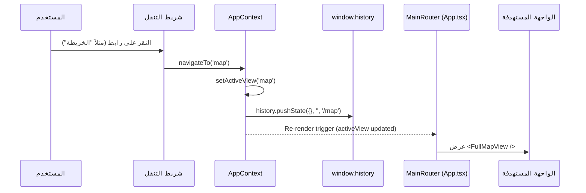

# معمارية الواجهة والتوجيه | Application & Routing Architecture

تشرح هذه الوثيقة كيفية إدارة التنقل بين الصفحات والواجهات بدون الاعتماد على مكتبات خارجية ثقيلة (مثل React Router)، مما يحافظ على خفة الحزمة وسرعة التحميل.

---

## 1. نموذج التوجيه القائم على الحالة (State-Based Routing)

### 1.1 لماذا تجنب التوجيه الخارجي المعقد؟
يعمل التطبيق داخل بيئات متعددة (مثل بيئة العرض المضمنة iFrame في AI Studio، أو خوادم الاستضافة الثابتة). لذلك، اعتمد المشروع على **موجّه الحالة المباشر (Direct State Router)** المعرف في `src/context/AppContext.tsx` و `src/App.tsx`.



### 1.2 كود التوجيه الفعلي في `src/App.tsx`
```tsx
const renderView = () => {
  switch (activeView) {
    case 'home': return <HomeView />;
    case 'map': return <FullMapView />;
    case 'capabilities': return <CapabilityView />;
    case 'learn': return <LearnView />;
    case 'learning-paths': return <LearningPathsView />;
    case 'commands': return <CommandsView />;
    case 'playbooks': return <PlaybooksView />;
    case 'generators':
    case 'claude-md-generator':
    case 'skill-generator':
    case 'subagent-generator':
      return <GeneratorsView />;
    case 'prompt-lab': return <PromptLabView />;
    case 'dashboard': return <DashboardView />;
    default: return <HomeView />;
  }
};
```

---

## 2. مزامنة عنوان المتصفح (URL Path Synchronization)
عند بدء تشغيل التطبيق، يقوم `AppContext` بقراءة مسار الرابط الحالي `window.location.pathname`:
```tsx
const [activeView, setActiveView] = useState<ActiveView>(() => {
  try {
    const path = window.location.pathname.replace(/^\/+/, '');
    if (['learn', 'capabilities', 'map', 'learning-paths', 'commands', 'playbooks', 'prompt-lab', 'generators', 'dashboard'].includes(path)) {
      return path as ActiveView;
    }
  } catch {}
  return 'home';
});
```
وعند استدعاء دالة `navigateTo(view, capabilityId)`:
1. يتم تحديث `activeView`.
2. يتم تحديث `selectedCapabilityId` (إذا تم تمريره).
3. يتم تحديث مسار المتصفح برمجياً دون إعادة تحميل الصفحة (`window.history.pushState`).

---

## 3. تكامل لوحة الأوامر السريعة (Command Palette - Cmd+K)
- مكون `src/components/common/CommandPalette.tsx` يستمع لاختصار لوحة المفاتيح (`Meta+K` أو `Ctrl+K`).
- يسمح بالبحث الفوري في كافة العقد والواجهات والأوامر والتنقل الفوري بنقرة واحدة أو ضغط مفتاح Enter.

---
*الوثائق ذات الصلة:*
- [معمارية النظام](./system-architecture.md)
- [إدارة الحالة](../03-codebase/state-management.md)
