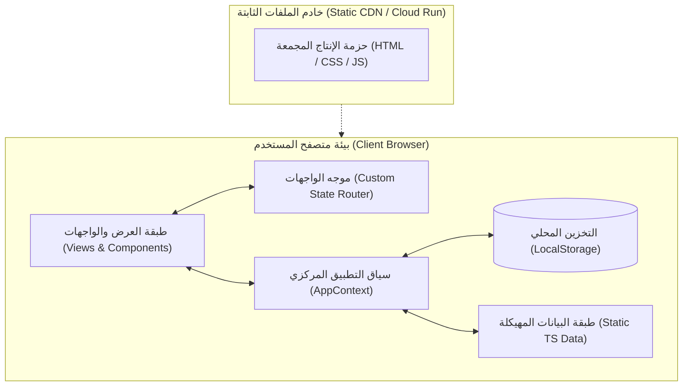

# نظرة عامة على المعمارية | Architecture Overview

## 1. الفلسفة المعمارية (Architectural Philosophy)
تم بناء **Claude Atlas** وفق مبدأ **"التطبيق المستقل المعتمد كلياً على جانب العميل (Zero-Backend Client-Only Architecture)"**. 
الهدف المعماري الأساسي هو تقديم أداء فائق وسرعة استجابة لحظية، مع خفض كلفة البنية التحتية إلى الصفر، وتوفير حماية تامة لخصوصية المستخدم وتفضيلاته.

---

## 2. الطبقات المعمارية (Architectural Layers)

### 2.1 طبقة العرض والواجهات (Presentation Layer)
- تقع في مجلدي `src/views/` و `src/components/`.
- مسؤولة حصرياً عن تجربة المستخدم، الرسم البصري (SVG / Tailwind)، وتلقي التفاعلات (Clicks, Drag, Search, Filtering).
- مفصولة تماماً عن منطق تعديل البيانات الخام، حيث تتواصل فقط عبر خطافات (Hooks) مأخوذة من السياق المركزي `useApp()`.

### 2.2 طبقة التوجيه وإدارة الحالة (Routing & State Layer)
- تقع في `src/context/AppContext.tsx` و `src/App.tsx`.
- تدير:
  - الواجهة النشطة حالياً (`activeView`).
  - العقدة المعمارية المختارة (`selectedCapabilityId`).
  - مسار التعلم المخصص (`learningPathCapabilityIds`).
  - الإشارات المرجعية والوحدات المكتملة (`bookmarkedCapabilityIds`, `completedUnitIds`).
  - تفضيلات اللغة (`language`) والسمة والبحث.
- تقوم بمزامنة التغييرات تلقائياً وبشكل غير تزامني مع `localStorage`.

### 2.3 طبقة البيانات الثابتة (Static Data Layer)
- تقع في مجلد `src/data/`.
- تمثل المعجم المعرفي الشامل للمشروع ومصدر الحقيقة (SSOT).
- مكتوبة كـ TypeScript Modules مع فحوصات صارمة مطابقة للواجهات المعرفة في `src/types.ts`.

---

## 3. المبادئ المعمارية الحاكمة (Guiding Principles)
1. **Unidirectional Data Flow**: تدفق البيانات في اتجاه واحد من الحالة المركزية (`AppContext`) إلى الواجهات والمكونات كـ Props.
2. **Type Safety Everywhere**: لا وجود لـ `any` غير مبرر؛ كل كائن أو خاصية تخضع لواجهات TypeScript محددة.
3. **No Hidden Network Requests**: لا يقوم التطبيق بأي استدعاءات شبكية غير مرئية أو تتبع للمستخدم؛ التطبيق يعمل حتى في وضع انقطاع الاتصال الكامل بعد التحميل الأولي.

---
*الوثائق ذات الصلة:*
- [معمارية النظام ومخططات التدفق](./system-architecture.md)
- [هيكل المجلدات](./folder-structure.md)
- [سجل القرارات المعمارية](../adr/0004-pure-client-architecture.md)
