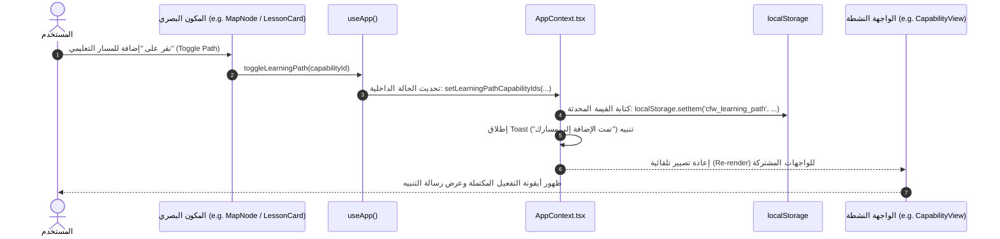

# تدفق البيانات ودورة حياة التفاعل | Data & Events Flow

توضح هذه الوثيقة كيفية تدفق البيانات بين مختلف طبقات التطبيق، بدءاً من تفاعل المستخدم، مروراً بالسياق المركزي `AppContext`، وصولاً إلى التحديث البصري وتخزين الحالة.

---

## 1. مخطط تدفق دورة التفاعل (Unidirectional Interaction Cycle)



---

## 2. آليات قراءة البيانات وحقنها

### 2.1 تحميل البيانات الثابتة (Static Hydration)
- عند تشغيل التطبيق، يتم استيراد مصفوفات البيانات مباشرة من `src/data/capabilities.ts` ومجلد `data/`.
- لا توجد عمليات `fetch` عبر الشبكة؛ البيانات جاهزة وفورية في الذاكرة (In-Memory).

### 2.2 حقن الإثراء المعرفي (Data Enrichment Integration)
- لتقليل تضخم ملف `capabilities.ts` الأساسي، تم فصل التوسعات المتقدمة للدروس (الـ 14 نقطة والتمارين والاختبارات) في ملف `capabilitiesEnrichment.ts`.
- يقوم مكون عرض الدروس (`LessonRenderer` أو `CapabilityDetailDrawer`) بدمج العقدة الأساسية مع بيانات الإثراء المعرفي المقابلة لها عبر المفتاح الفريد `id`:
```typescript
const baseNode = CAPABILITIES.find(c => c.id === selectedCapabilityId);
const enrichment = CAPABILITY_ENRICHMENTS[selectedCapabilityId];
const completeLesson = { ...baseNode, ...enrichment };
```

---

## 3. معالجة الأحداث والبحث (Search & Event Pipeline)
- عند كتابة استعلام في حقل البحث أو لوحة الأوامر (`CommandPalette`):
  1. يتم تحديث `searchQuery` في الحالة.
  2. تقوم الواجهات بحساب العناصر المطابقة باستخدام عمليات تصفية خفيفة (`filter` / `includes`) مع تحويل النصوص لحروف صغيرة (Lowercase) وتطبيع النصوص العربية للبحث المرن.
  3. يتم الحساب لحظياً بدون الحاجة لـ Debounce معقد بفضل قلة الحمل وحجم البيانات المحكم في الذاكرة.

---
*الوثائق ذات الصلة:*
- [معمارية الواجهة](./application-architecture.md)
- [إدارة الحالة](../03-codebase/state-management.md)
- [التخزين المحلي](../06-storage-and-state/persistence.md)
