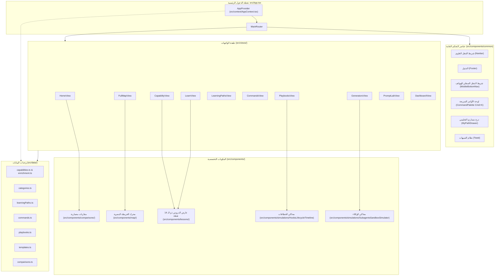

# معمارية النظام | System Architecture

توضح هذه الوثيقة المخططات الهندسية لعناصر تطبيق **Claude Atlas**، وتفاصيل تفاعل المكونات البرمجية فيما بينها.

---

## 1. مخطط مكونات النظام (Component Architecture Diagram)

---

## 2. بنية المكونات التفاعلية وحجمها

### 2.1 محرك الخريطة البصرية (`src/components/map/`)
- يعتمد على مصفوفة العقد والعلاقات المعمارية (`nodes` و `edges`) لرسم خريطة شبكية تفاعلية باستخدام تقنيات SVG الصافية.
- يدعم التكبير، التحريك (Zoom/Pan)، وتحديد العقد لفتح تفاصيلها مباشرة في درج التفاصيل (Detail Drawer).

### 2.2 محاكي الوكلاء الفرعيين (`SubagentsSandboxSimulator.tsx`)
- محاكي تفاعلي يعرض دورة حياة استدعاء الوكيل الفرعي:
  1. بدء المهمة (Spawn)
  2. عزل السياق وحقن الأدوات المحددة
  3. تنفيذ الأدوات بالتوازي
  4. تلخيص النتائج والعودة للمحادثة الأساسية.

### 2.3 محاكي خطافات دورة الحياة (`HooksLifecycleTimeline.tsx`)
- خط زمني تفاعلي يحاكي اعتراض الأحداث:
  - `Pre-Tool`: التحقق من الصلاحيات والبارامترات.
  - `Permission-Gate`: موافقة المستخدم أو الرفض التلقائي.
  - `Execution`: تشغيل الأمر.
  - `Post-Tool`: تسجيل السجلات والتوثيق.
  - `On-Error`: استراتيجية التعافي والتحليل.

---
*الوثائق ذات الصلة:*
- [معمارية التطبيق](./application-architecture.md)
- [تدفق البيانات](./data-flow.md)
