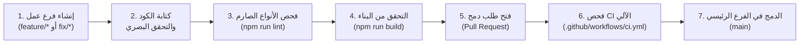

# سير عمل التطوير اليومي | Development Workflow

يشرح هذا الدليل دورة حياة العمل المتبعة لتطوير الميزات وإصلاح الأخطاء في مشروع **Claude Atlas**.

---

## 🔄 1. دورة حياة الميزة البرمجية (Feature Lifecycle)



---

## ⚙️ 2. خطوات التحقق قبل الدفع (Pre-Push Verification)

قبل دفع التعديلات إلى المستودع أو فتح طلب دمج (PR)، يجب على المطور تشغيل الخطوتين التاليتين والتأكد من خلو الطرفية من أي أخطاء:

### 1. التحقق من صحة الأنواع (Type Checking)
```bash
npm run lint
```
*يجب ألا يُرجع هذا الأمر أي خطأ من مترجم TypeScript (`tsc --noEmit`).*

### 2. التحقق من بناء الإنتاج (Production Build Check)
```bash
npm run build
```
*يتحقق هذا الأمر من قدرة Vite على تجميع كافة الأصول والملفات داخل مجلد `dist/` دون أخطاء في مسارات الاستيراد أو حزم التبعيات.*

---

## 🌿 3. معايير تسمية الفروع (Branch Naming Conventions)

- **الميزات الجديدة**: `feature/add-mcp-simulator` أو `feature/enrich-memory-lesson`
- **إصلاح الأخطاء**: `fix/drawer-close-issue` أو `fix/search-arabic-normalization`
- **التوثيق**: `docs/update-architecture-guides`
- **إعادة الهيكلة**: `refactor/split-large-view`

---
*الوثائق ذات الصلة:*
- [إعداد البيئة](./setup.md)
- [إرشادات المساهمة](./contribution-guide.md)
