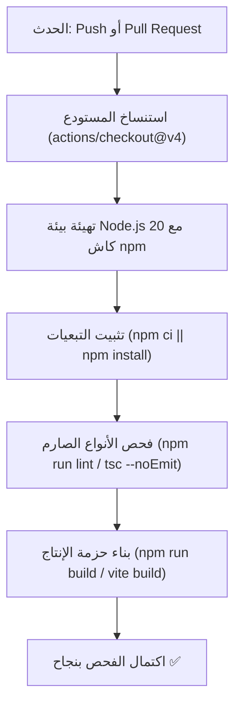

# سير عمل التكامل والنشر المستمر | CI/CD Workflow

توثق هذه الوثيقة مسار التكامل المستمر المعتمد في المشروع والمُعرف في `.github/workflows/ci.yml`.

---

## 🚀 1. مسار GitHub Actions (`ci.yml`)

يعمل المسار تلقائياً عند:
- الدفع (`push`) إلى فرعي `main` أو `master`.
- فتح أو تحديث أي طلب دمج (`pull_request`) مستهدف لـ `main` أو `master`.



---

## 2. محتوى ملف سير العمل الفعلي

```yaml
name: CI

on:
  push:
    branches: [ main, master ]
  pull_request:
    branches: [ main, master ]

jobs:
  build-and-test:
    runs-on: ubuntu-latest

    steps:
      - name: Checkout repository
        uses: actions/checkout@v4

      - name: Set up Node.js
        uses: actions/setup-node@v4
        with:
          node-version: 20
          cache: 'npm'

      - name: Install dependencies
        run: npm ci || npm install

      - name: Type check and Lint
        run: npm run lint

      - name: Build project
        run: npm run build
```

---
*الوثائق ذات الصلة:*
- [التحقق البرمجي](../05-quality/verification.md)
- [إرشادات المساهمة](../04-development/contribution-guide.md)
