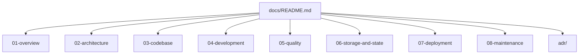

# 📚 منظومة التوثيق المعماري والهندسي | Documentation System
## أطلس كلود — Claude Atlas

مرحباً بك في مركز التوثيق الرسمي لـ **أطلس كلود (Claude Atlas)**، المنصة المعرفية والمعمارية التفاعلية المخصصة لمنظومة Claude Code للمطورين والمهندسين.

تم تصميم هذه المنظومة التوثيقية لتمثل **مرجعاً هندسياً موحداً (Single Source of Truth)** يغطي المشروع من الرؤية العامة وحتى تفاصيل التنفيذ الداخلي، دون الحاجة للغوص العشوائي في الشيفرة المصدرية.

---

## 🧭 خريطة الملاحة السريعة | Quick Navigation

| القسم | الدليل | الوصف والهدف | الجمهور المستهدف |
| :--- | :--- | :--- | :--- |
| **01. النظرة العامة** | [`01-overview/`](./01-overview/project-overview.md) | ماهية المشروع، المشكلة، الأهداف، النطاق، ومسرد المصطلحات. | أصحاب القرار، المطورون الجدد |
| **02. المعمارية** | [`02-architecture/`](./02-architecture/architecture-overview.md) | معمارية النظام، المخططات الهندسية، وفصل المسؤوليات. | المعماريون، مهندسو البرمجيات |
| **03. الشيفرة والمكونات** | [`03-codebase/`](./03-codebase/codebase-overview.md) | خريطة الواجهات الـ 10، المكونات، إدارة الحالة، ودليل التوسيع. | مهندسو الواجهات الأمامية |
| **04. التطوير والإعداد** | [`04-development/`](./04-development/setup.md) | متطلبات التشغيل، الأوامر الفعلية، معايير الشيفرة والمساهمة. | المطورون، المساهمون |
| **05. الجودة والتحقق** | [`05-quality/`](./05-quality/verification.md) | فحص الأنواع (Linting)، واقع الاختبارات، وحل المشكلات الشائعة. | فرق الجودة، المطورون |
| **06. التخزين والحالة** | [`06-storage-and-state/`](./06-storage-and-state/persistence.md) | آليات `localStorage` ومصادر الحقيقة المعيارية للمشروع. | المعماريون، مهندسو النظم |
| **07. النشر والتشغيل** | [`07-deployment/`](./07-deployment/deployment-overview.md) | خطوات البناء للإنتاج، إعدادات البيئة، وسير عمل CI/CD. | مهندسو DevOps والنشر |
| **08. الصيانة والأداء** | [`08-maintenance/`](./08-maintenance/technical-debt.md) | الدين التقني المسجل، اعتبارات الأداء، والتحسينات المستقبلية. | قادة الفرق، المعماريون |
| **09. القرارات المعمارية** | [`adr/`](./adr/README.md) | سجل القرارات المعمارية المعتمدة (ADRs) وأسباب اتخاذها. | جميع أعضاء الفريق التقني |

---

## 👥 مسارات القراءة حسب الدور | Role-Based Reading Paths

### 👔 لصناع القرار وأصحاب المنتج (Executive & Product)
1. ابدأ بقراءة [نظرة عامة على المشروع](./01-overview/project-overview.md).
2. استعرض [أهداف المنصة](./01-overview/goals.md) و [حدود النطاق](./01-overview/scope.md).
3. اطلع على [سجل الدين الفني](./08-maintenance/technical-debt.md).

### 📐 للمعماريين التقنيين (Solution & Software Architects)
1. اقرأ [نظرة عامة على المعمارية](./02-architecture/architecture-overview.md).
2. افحص [معمارية النظام ومخططات Mermaid](./02-architecture/system-architecture.md).
3. راجع [سجل القرارات المعمارية](./adr/README.md).
4. تفحص [استراتيجية التخزين ومصادر الحقيقة](./06-storage-and-state/source-of-truth.md).

### 💻 للمطورين والمساهمين الجدد (New Developers & Contributors)
1. اتبع خطوات [إعداد بيئة التطوير وتشغيل المشروع](./04-development/setup.md).
2. استكشف [خريطة الشيفرة والمكونات](./03-codebase/codebase-overview.md).
3. تعلم كيفية إضافة ميزة جديدة خطوة بخطوة من خلال [دليل التوسيع والتطوير](./03-codebase/extension-guide.md).
4. التزم بـ [المعايير البرمجية المعتمدة](./04-development/coding-standards.md).

---

## 📌 القواعد الذهبية للتوثيق
- **التوثيق يصف الواقع الفعلي**: جميع البيانات تعتمد على الحزم والإعدادات والشيفرة الحقيقية بالمستودع.
- **تحديث التوثيق متزامن مع الكود**: عند إضافة أي واجهة جديدة أو نوع جديد في `types.ts`، يجب تحديث التوثيق المقابل في `docs/`.
- **ممنوع الافتراض**: إذا كانت هناك خاصية غير مفعّلة في بيئة التشغيل، تُسجل صراحة في قسم الملاحظات أو الدين الفني.
